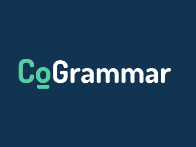

# Welcome to Cogrammar! 🚀

## About Us 🎓

Cogrammar is at the cutting edge of computer science education, creating a bridge between academic knowledge and industry expertise. Our mission is to empower learners with vital skills and hands-on experience to thrive in the tech world 🌐.

Visit us at [Cogrammar](https://skills.cogrammar.com/) to start your journey with a community passionate about coding and innovation.

## Our Repositories 📚

Our GitHub organization is a treasure trove of knowledge:

- **Software Engineering Lecture Backpacks**: Packed with lessons in Python for budding software engineers.
- **Data Science Lecture Backpacks**: Jupyter notebooks brimming with data science wonders.
- **Development Environment Setups**: Shell scripts to get your coding environment up and running without a hitch.

Every repository is an invitation to learn, contribute, and grow 🌱.

## Getting Started 🚦

1. **Explore**: Check out our repositories for a wide range of topics.
2. **Learn**: Immerse yourself in our content, filled with exercises and real-world projects.
3. **Contribute**: Got something to add? Fork, edit, and pull request!
4. **Discuss**: Questions or ideas? Start a discussion or issue ticket.

## Stay Connected 🤝

- Discover more on our [website](https://skills.cogrammar.com/).
- Network with us on [LinkedIn](https://www.linkedin.com/company/cogrammar/about/).

We're thrilled to embark on this learning adventure with you. Together, we code towards a brighter future! ✨
